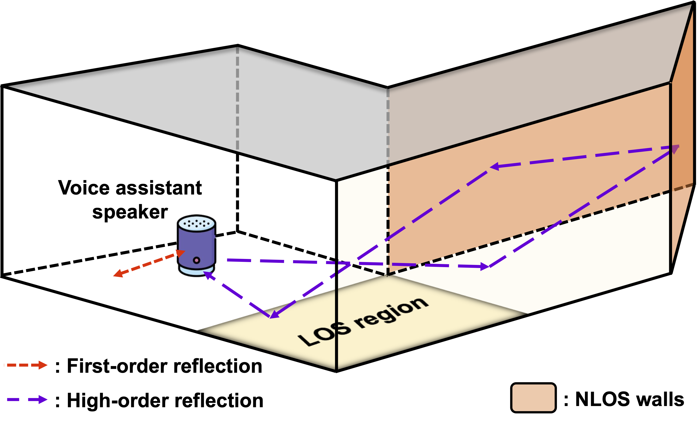
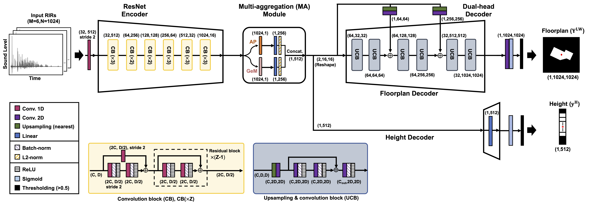
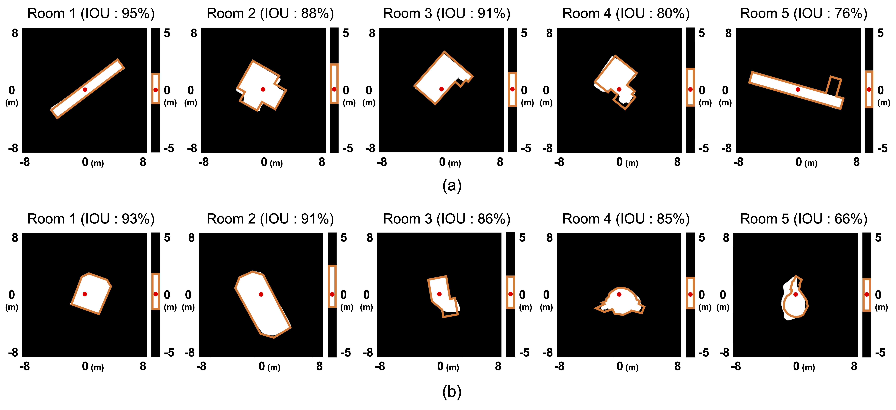

# EchoScan: Scanning Complex Room Geometries via Acoustic Echoes

Official implementation of IEEE/ACM Transactions on Audio, Speech, and Language Processing (IEEE/ACM TASLP) 2024 paper **"[EchoScan: Scanning Complex Room Geometries via Acoustic Echoes](https://ieeexplore.ieee.org/document/10729857)."**

## Abstract

*Accurate estimation of indoor space geometries is vital for constructing precise digital twins, whose broad industrial applications include navigation in unfamiliar environments and efficient evacuation planning, particularly in low-light conditions. This study introduces EchoScan, a deep neural network model that utilizes acoustic echoes to perform room geometry inference. Conventional sound-based techniques rely on estimating geometry-related room parameters such as wall position and room size, thereby limiting the diversity of inferable room geometries. Contrarily, EchoScan overcomes this limitation by directly inferring room floorplan maps and height maps, thereby enabling it to handle rooms with complex shapes, including curved walls. The segmentation task for predicting floorplan and height maps enables the model to leverage both low- and high-order reflections. The use of high-order reflections further allows EchoScan to infer complex room shapes when some walls of the room are unobservable from the position of an audio device. Herein, EchoScan was trained and evaluated using RIRs synthesized from complex environments, including the Manhattan and Atlanta layouts, employing a practical audio device configuration compatible with commercial, off-the-shelf devices.*

## Requirements
First, prepare Python environment using the Anaconda.
```shell
# Create conda environment
conda create -n echoscan python=3.9
conda activate echoscan
# Clone the repository
git clone https://github.com/inmoyeon/EchoScan.git
cd EchoScan
```

Install essential packages
```
Python==3.9
PyTorch==1.13.1
pyroomacoustics
opencv-python
numpy
tqdm
scipy
tensorboard
```
or install packages using requirements.txt.
```shell
pip install -r requirements.txt
```

## EchoScan

To train the EchoScan, run the following command. The training configuration can be modified in the ```train.py```.
```shell
python train.py
```

## Dataset preparation
### Basic room dataset

To build basic room dataset, including RIRs and floorplans simulated from five types of rooms, run the following command.
```shell
python build_room.py
```

### Manhattan-Atlanta room dataset

Due to the copyright issue, we cannot directly provide the Manhattan-Atlanta room dataset.

First, you need to obtain the original dataset from [AtlantaNet](https://github.com/crs4/AtlantaNet) repository.
This dataset includes panoramic images and coordinates of corner points of these images.

To convert these corner points from panoramic to 3D corner points using the conversion code [```misc/post_proc.py```](https://github.com/sunset1995/HorizonNet/blob/master/misc/post_proc.py) from the [HorizonNet](https://github.com/sunset1995/HorizonNet/tree/master) repository.

Then, run follwoing command to generate RIRs and floorplans.
```shell
python build_room_MA.py
```

## Citations
```bibtex
@article{yeon2024echoscan,
  title={EchoScan: Scanning Complex Room Geometries via Acoustic Echoes},
  author={Yeon, Inmo and Jeong, Iljoo and Lee, Seungchul and Choi, Jung-Woo},
  journal={IEEE/ACM Transactions on Audio, Speech, and Language Processing},
  year={2024},
  publisher={IEEE}
}
```